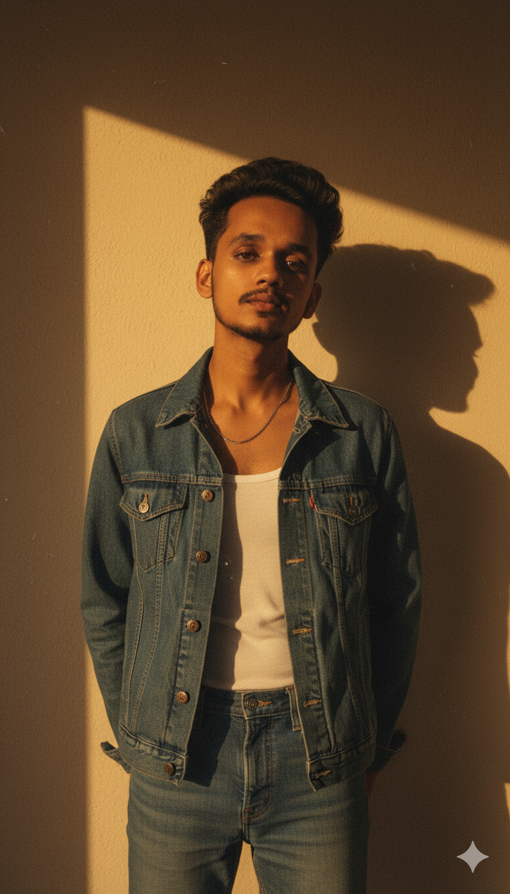

# [Teja Naik | Portfolio](https://portfolioo-two-wheat.vercel.app/)

Hi there! 👋 I'm **Teja Naik**, a Frontend & Full-Stack Developer passionate about creating interactive, visually stunning, and user-friendly web experiences.

---

## 🚀 Tech Stack

   
  
  
  
  
  

---

## 📂 Project Structure

/src
├─ /components
│ ├─ LightRays.jsx
│ ├─ GooeyNav.jsx
│ ├─ SharedProfileCard.jsx
│ ├─ FloatingCoffeeButton.jsx
│ └─ SmoothCursor.jsx
├─ /sections
│ ├─ Home.jsx
│ ├─ About.jsx
│ ├─ Skills.jsx
│ ├─ Projects.jsx
│ ├─ Education.jsx
│ └─ Contact.jsx
├─ /layouts
│ └─ Footer.jsx
├─ /context
│ ├─ ThemeContext.jsx
│ └─ MusicContext.jsx
├─ App.jsx
├─ main.jsx
└─ index.css

markdown
Copy code

---

## ⚙️ Dependencies

- **React.js**  
- **Tailwind CSS**  
- **GSAP**  
- **Framer Motion**  
- **React Router DOM**  
- **react-icons**  
- **EmailJS** (optional for contact form)

Install dependencies:

bash
npm install
🎨 Features
Dark/Light Theme Support 🌗

Smooth Cursor & Light Rays Animations ✨

Scroll Reveal Animations on all sections 🖼️

Gooey Navigation for single-page scrolling 🌀

Floating Coffee Button ☕

Responsive & Accessible Design 📱

Custom Scrollbars & Gradient Text Animations 🎨

---

## 💻 Quick Start
Clone the repo:

- **Copy code**
- **git clone https://github.com/TejaNaik15/portfolioo.git**
- **cd portfolioo**
- **npm install**
- **npm run dev**
- **Build for production**

---
## 📫 Contact Me

    

---
## 💡 Fun Fact
I love adding fun micro-interactions like smooth cursors, floating buttons, and dynamic light rays to make web experiences delightful. 🎉
---

## ⭐ Support
If you enjoy this project, give it a ⭐ and share your feedback! 💌

 Made by <strong>Teja Naik</strong> 

