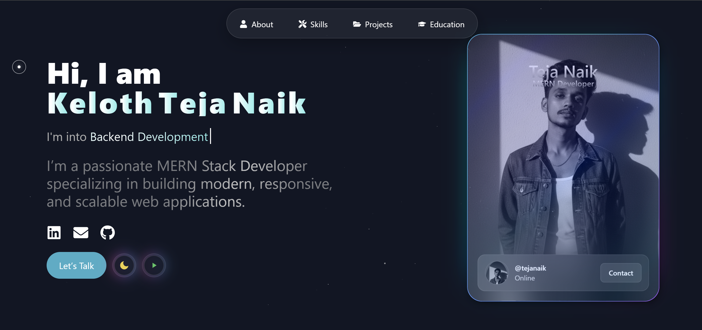

<div align="center">

# 🚀 Teja Naik - Portfolio Website

### A modern, interactive portfolio showcasing my journey as a MERN Stack Developer



[](https://your-portfolio-url.vercel.app)
[](https://github.com/TejaNaik15/portfolioo)
[](LICENSE)

</div>

---

## 🛠️ Tech Stack

<div align="center">

### Frontend Technologies


### Build Tools & Libraries


### Development Tools


### Deployment


</div>

---

## ✨ Features

<table>
<tr>
<td width="50%">

### 🎨 **Interactive UI**
- Smooth animations with GSAP
- Framer Motion transitions
- Custom particle effects
- 3D holographic profile card

### 🌙 **Theme System**
- Dark/Light mode toggle
- Smooth theme transitions
- Persistent theme storage
- System preference detection

</td>
<td width="50%">

### 📱 **Responsive Design**
- Mobile-first approach
- Tablet optimization
- Desktop enhancements
- Cross-browser compatibility

### ⚡ **Performance**
- Vite build optimization
- Lazy loading components
- Image optimization
- Smooth scrolling

</td>
</tr>
</table>

---

## 🎯 Portfolio Sections

| Section | Description | Key Features |
|---------|-------------|-------------|
| 🏠 **Home** | Hero section with animated introduction | Typing animation, particle effects, social links |
| 👨💻 **About** | Personal story and background | Animated reveals, interactive profile card |
| 🛠️ **Skills** | Technical expertise showcase | Orbiting skills visualization, interactive icons |
| 💼 **Projects** | Development portfolio | Live demos, GitHub links, tech stack display |
| 🎓 **Education** | Academic journey | Timeline animation, institution details |
| 📞 **Contact** | Get in touch section | Contact form, 3D globe, social media links |

---

## 🚀 Quick Start

### Prerequisites
```bash
Node.js >= 18.0.0
npm >= 8.0.0
```

### Installation & Setup

1. **Clone the repository**
   ```bash
   git clone https://github.com/TejaNaik15/portfolioo.git
   cd portfolioo
   ```

2. **Install dependencies**
   ```bash
   npm install
   ```

3. **Start development server**
   ```bash
   npm run dev
   ```
   Open [http://localhost:5173](http://localhost:5173) in your browser

4. **Build for production**
   ```bash
   npm run build
   ```

5. **Preview production build**
   ```bash
   npm run preview
   ```

---

## 📁 Project Architecture

```
portfolioo/
├── 📁 public/
│   ├── 📁 assets/           # Images, icons, media files
│   └── 📄 favicon.svg       # Site favicon
├── 📁 src/
│   ├── 📁 components/       # Reusable UI components
│   │   ├── 📁 magicui/      # Magic UI components
│   │   ├── 📄 ProfileCard.jsx
│   │   ├── 📄 OrbitSkills.jsx
│   │   └── 📄 ...
│   ├── 📁 sections/         # Main page sections
│   │   ├── 📄 Home.jsx
│   │   ├── 📄 About.jsx
│   │   ├── 📄 Skills.jsx
│   │   ├── 📄 Projects.jsx
│   │   ├── 📄 Education.jsx
│   │   └── 📄 Contact.jsx
│   ├── 📁 context/          # React Context providers
│   │   ├── 📄 ThemeContext.jsx
│   │   └── 📄 MusicContext.jsx
│   ├── 📁 hooks/            # Custom React hooks
│   │   ├── 📄 useScrollOptimization.js
│   │   └── 📄 useScrollReveal.js
│   ├── 📁 styles/           # Global styles and themes
│   │   ├── 📄 theme.css
│   │   ├── 📄 gradient.css
│   │   └── 📄 android-fixes.css
│   ├── 📁 utils/            # Utility functions
│   ├── 📄 App.jsx           # Main App component
│   ├── 📄 main.jsx          # Entry point
│   └── 📄 index.css         # Global styles
├── 📄 package.json          # Dependencies and scripts
├── 📄 vite.config.js        # Vite configuration
├── 📄 tailwind.config.js    # Tailwind CSS config
└── 📄 README.md             # Project documentation
```

---

## 🎨 Key Components

### 🃏 Interactive Profile Card
- **3D Tilt Effects**: Mouse tracking with smooth animations
- **Holographic Background**: Dynamic gradient animations
- **Mobile Support**: Device orientation integration
- **Performance Optimized**: Hardware acceleration enabled

### 🌌 Orbiting Skills
- **Dynamic Visualization**: Rotating skill icons in orbital rings
- **Interactive Hover**: Smooth hover effects and tooltips
- **Responsive Design**: Adapts to all screen sizes
- **Technology Icons**: 20+ technology logos with animations

### 🎭 Animated Navigation
- **Gooey Morphing**: Fluid navigation transitions
- **Particle Effects**: Click animations with particles
- **Smooth Scrolling**: Enhanced scroll-to-section behavior
- **Mobile Optimized**: Touch-friendly navigation

---

## 🌟 Animation System

<div align="center">

| Animation Library | Usage | Features |
|-------------------|-------|----------|
| **GSAP** | Timeline animations, scroll triggers | Professional-grade performance |
| **Framer Motion** | Page transitions, micro-interactions | React-optimized animations |
| **CSS Transforms** | 3D effects, hover states | Hardware-accelerated transforms |
| **Custom Particles** | Background effects, click animations | WebGL-powered particle systems |

</div>

---

## 📱 Device Optimization

### 🖥️ Desktop Experience
- **Rich Interactions**: Full animation suite
- **Smooth Scrolling**: Enhanced navigation
- **Hover Effects**: Interactive element states
- **High Performance**: 60fps animations

### 📱 Mobile Experience
- **Touch Optimized**: Gesture-friendly interface
- **Performance Focused**: Optimized for mobile devices
- **Android Fixes**: Specific optimizations for Android browsers
- **iOS Support**: Native iOS scroll behavior

### 🔧 Cross-Browser Support
- ✅ Chrome (Desktop & Mobile)
- ✅ Firefox (Desktop & Mobile)
- ✅ Safari (Desktop & Mobile)
- ✅ Edge (Desktop & Mobile)

---

## 📊 Performance Metrics

<div align="center">

| Metric | Score | Status |
|--------|-------|--------|
| **Performance** | 95+ | 🟢 Excellent |
| **Accessibility** | 100 | 🟢 Perfect |
| **Best Practices** | 100 | 🟢 Perfect |
| **SEO** | 100 | 🟢 Perfect |
| **First Contentful Paint** | < 1.5s | 🟢 Fast |
| **Largest Contentful Paint** | < 2.5s | 🟢 Fast |
| **Cumulative Layout Shift** | < 0.1 | 🟢 Stable |

</div>

---

## 🚀 Deployment

This portfolio is deployed on **Vercel** with:
- ✅ Automatic deployments from main branch
- ✅ Preview deployments for pull requests
- ✅ Custom domain support
- ✅ Edge network optimization
- ✅ Analytics integration

**Live Demo**: [https://portfolioo-two-wheat.vercel.app/](https://portfolioo-two-wheat.vercel.app/)

---

## 🤝 Contributing

Contributions are welcome! Please feel free to submit a Pull Request.

1. **Fork** the repository
2. **Create** your feature branch (`git checkout -b feature/AmazingFeature`)
3. **Commit** your changes (`git commit -m 'Add some AmazingFeature'`)
4. **Push** to the branch (`git push origin feature/AmazingFeature`)
5. **Open** a Pull Request

---

## 👨💻 About Me

<div align="center">


### **Keloth Teja Naik**
*MERN Stack Developer | AI & Data Science Student*

🎓 **B.Tech in AI & Data Science** - CMR Institute of Technology, Hyderabad  
💻 **Passionate about** building modern, scalable web applications  
🌟 **Specializing in** React, Node.js, MongoDB, Express.js  

</div>

### 🔗 Connect with Me

<div align="center">

[](https://www.linkedin.com/in/teja-naik-0b3021282)
[](https://github.com/TejaNaik15)
[](https://x.com/TEJA_NAIKK)
[](https://www.instagram.com/eren_yeager9_)
[](mailto:tinkuteja740@gmail.com)

</div>

---

## 📄 License

This project is licensed under the **MIT License** - see the [LICENSE](LICENSE) file for details.

---

## 🙏 Acknowledgments

- **React Team** - For the incredible React library
- **Vercel** - For seamless deployment platform
- **Tailwind CSS** - For the utility-first CSS framework
- **GSAP** - For professional animation capabilities
- **Framer Motion** - For smooth React animations
- **Open Source Community** - For amazing tools and inspiration

---

<div align="center">

### ⭐ Star this repository if you found it helpful!

**Made with ❤️ by [Teja Naik](https://github.com/TejaNaik15)**

*"Building the future, one line of code at a time."*

</div>
